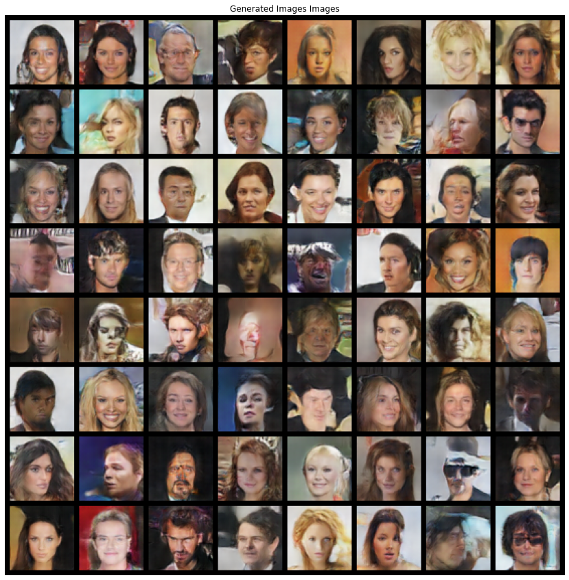

# Deep Convolutional Generative Adversarial Networks (DCGAN)
Before learning about DCGANs, learn about GANs.

## What is a GAN?
A Generative Adversarial Network is a framework composed of Deep Learning architectures and training methodlogies such that the network can learn the distribution of the data and thus can generate new data from the learnt distribution.

A GAN consist of 2 networks competing with one another:
1. Generator - Generates *fake* data from the learnt distribution. It constantly tries to fool the discriminator, such that discriminator tells that the given data (produced by generator) is real.
2. Discriminator - Discriminates between *fake* and *real* data. It constantly tries to catch the fakery of the generator.

You kind of say that the Generator is like a Fake politician spreading lies and Discriminator is like a good journalist trying to bust the lie. The difference being generator here can be useful to us. XP

The equilibrium is reached when the discriminator starts guessing to 50% and generator is generating near real data.

## DCGANs
DCGANs are GANs using convolutional and convolutional-transpose layers in the architectures of discriminators and generators respectively.

## Generated Examples

||
|:--:|
|Generated Images|

